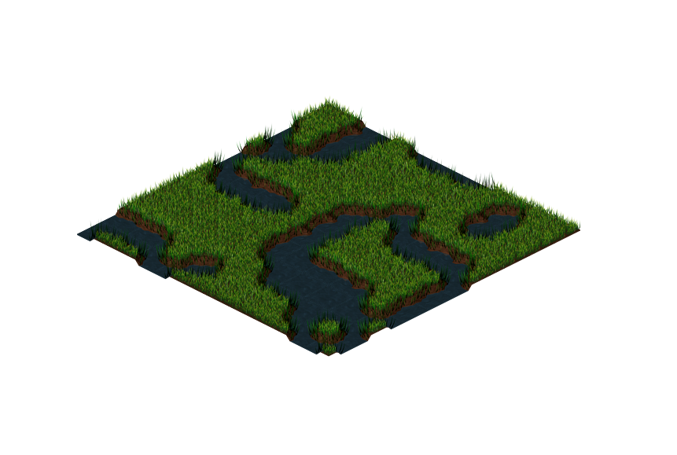

# Simple Wave Function Collapse

[Live version](https://victorribeiro.com/simpleWFC)

## About

A simplified version of the Wave Function Collapse algorithm.

Clarification: I got the name for this project from (https://github.com/mxgmn/WaveFunctionCollapse)[https://github.com/mxgmn/WaveFunctionCollapse]. I tried not to look at their code, or any other code for that matter. I got my self familiar with the concepts from WFC (from all sorts of materials) and tried to implement them.
